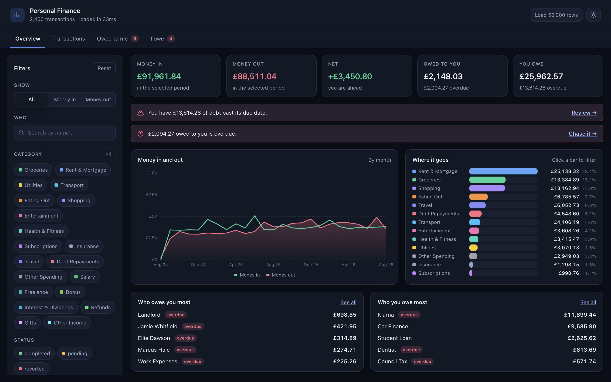
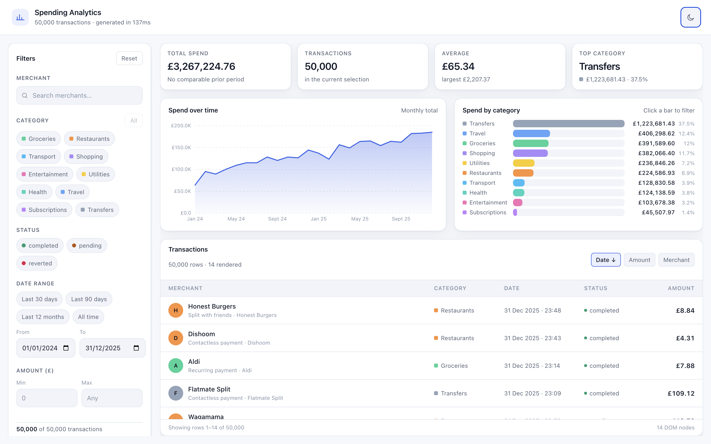

# Spending Analytics Dashboard

A personal-finance analytics dashboard that loads **50,000 transactions** in the browser and keeps
filtering, sorting and charting them at interactive speed.

[](https://github.com/salahalomar/spending-analytics-dashboard/actions/workflows/ci.yml)
[](https://github.com/salahalomar/spending-analytics-dashboard/actions/workflows/deploy.yml)

**[Live demo →](https://salahalomar.github.io/spending-analytics-dashboard/)**



<details>
<summary>Light theme</summary>



</details>

---

## What it does

- **50,000 transactions**, generated client-side from a fixed seed so every visitor sees the same
  data and the numbers are reproducible.
- **A virtualised list** — scroll the whole dataset while only ~20 rows are ever mounted in the DOM.
- **Live filtering** by merchant, category, status, date range and amount, all combinable.
- **Two charts** — spend over time and spend by category — that follow the filters and double as
  filter controls.
- **Summary cards** comparing the selected window against the preceding window of equal length.
- **Light and dark themes**, persisted, defaulting to the OS preference.
- **Keyboard and screen-reader support** throughout, including arrow-key navigation of the chart.

## Built with

| Concern                  | Choice                                    |
| ------------------------ | ----------------------------------------- |
| UI                       | React 18 + TypeScript (strict)            |
| State                    | Redux Toolkit + Reselect                  |
| Build                    | Vite 6                                    |
| Unit / integration tests | Jest + React Testing Library              |
| End-to-end tests         | Cypress                                   |
| Linting / formatting     | ESLint (type-aware + jsx-a11y) + Prettier |
| CI                       | GitHub Actions                            |

There is no charting library and no virtual-list library — both are implemented here, because the
interesting parts of this project are exactly those two problems.

## The performance work

Rendering 50,000 rows is easy to get wrong in ways that only show up with real data. Four decisions
carry most of the weight:

**Only the visible rows exist.**
[`useVirtualizer`](src/hooks/useVirtualizer.ts) computes which slice of the list intersects the
viewport and renders only that, plus a small overscan. The scroll container is sized to the full
list height so the scrollbar stays honest. Scroll events are coalesced into an animation frame,
because a trackpad can fire them far more often than the browser paints. The range arithmetic is a
[pure exported function](src/hooks/useVirtualizer.ts) so it can be tested without a DOM.

**The merchant search never touches 50,000 strings.**
There are ~70 distinct merchant names in the dataset. The search box
[resolves the query against those names](src/features/transactions/selectors.ts) and the row filter
then does a `Set` membership test. Lower-casing and substring-scanning 50,000 strings on every
keystroke would be roughly three orders of magnitude more work.

**Filters are split so a slider doesn't redo everything.**
`selectFilteredIgnoringDate` runs the merchant, category, status and amount predicates;
`selectFilteredTransactions` layers the date range on top. Dragging a date input therefore re-runs
one cheap comparison per row instead of all five predicates — and the summary card reuses the
undated stage to compute the previous-period comparison for free.

**The default sort is free.**
The generator emits transactions newest-first and every filter preserves that order, so the default
view returns the same array reference rather than copying and sorting 50,000 objects.

Typing is debounced at 200ms, and the store's development-mode serialisability and immutability
checks are switched off — deep-scanning a 50,000 item array on every dispatch costs hundreds of
milliseconds and catches nothing here.

The result: **~75 kB gzipped**, the dataset built in around 100–300 ms, and a row count in the DOM
that stays flat no matter how far you scroll. The footer shows that number live.

## Accessibility

Not an afterthought, and not just labels:

- The virtualised list is a real `list`/`listitem` structure where each row
  reports `aria-setsize` of the **full** result count and its true `aria-posinset`, so a screen
  reader announces "row 12,481 of 50,000" rather than "12 of 20".
- Each row is a toggle wired to the detail panel with `aria-expanded` and `aria-controls`, and
  dismissing the panel hands focus back to the row rather than dropping it to the top of the page.
- The trend chart carries the same figures as a visually hidden table, so the series is readable
  rather than being an unlabelled graphic, and it can be stepped through with the arrow keys.
- Filter chips are `aria-pressed` toggles, the result count is an `aria-live` region, and every
  interactive element has a single visible focus treatment.
- Motion is dropped entirely under `prefers-reduced-motion`.

ESLint runs `jsx-a11y` over the source as part of CI.

## Getting started

```bash
npm install
npm run dev
```

Then open http://localhost:5173.

### Scripts

| Command                 | What it does                                 |
| ----------------------- | -------------------------------------------- |
| `npm run dev`           | Dev server with hot reload                   |
| `npm run build`         | Typecheck, then production build to `dist/`  |
| `npm run preview`       | Serve the production build on port 4173      |
| `npm run typecheck`     | `tsc --noEmit`                               |
| `npm run lint`          | ESLint over source, tests and Cypress specs  |
| `npm run format`        | Prettier write (`format:check` runs in CI)   |
| `npm test`              | Jest unit and integration tests              |
| `npm run test:coverage` | The same, with a coverage report             |
| `npm run cy:open`       | Cypress in interactive mode                  |
| `npm run e2e`           | Build-and-serve, then run Cypress headlessly |

## Testing

**211 Jest tests at ~97% statement coverage**, with the threshold enforced in
[`jest.config.cjs`](jest.config.cjs) so it cannot quietly rot.

The suite is layered rather than uniform:

- _Pure logic_ — the PRNG, the generator, the scale maths and the virtualiser's range calculation
  are tested directly as functions.
- _Reducers and selectors_ — tested against hand-checkable fixtures, including boundary days on
  date ranges and the previous-period comparison.
- _Components_ — rendered against a **real store**, not a mocked one, so the reducers and selectors
  are exercised as part of the test. The list is asserted to render ~20 rows for a 5,000-row dataset
  while still reporting the full count; the debounce is verified by dispatch count, so typing
  "tesco" must produce exactly one action.
- _Integration_ — [`App.test.tsx`](src/App.test.tsx) drives the whole dashboard through the UI.

[`jest.setup.ts`](jest.setup.ts) supplies what jsdom lacks: element dimensions, `ResizeObserver`,
and a `PointerEvent` built on `MouseEvent` so the chart's pointer handling can be exercised.

**Cypress** covers the journey end-to-end against the production build: load the dataset, confirm
only a window of rows is mounted, scroll deep into the list, filter by category, search a merchant,
apply a date preset, re-sort, open a transaction, and reset back to 50,000.

```bash
npm run e2e
```

## Project structure

```
src/
├── app/            Store configuration and pre-typed hooks
├── components/     UI, grouped by area (charts, filters, transactions, …)
├── data/           Seeded PRNG and the transaction generator
├── features/       Redux slices and the selector layer
├── hooks/          useVirtualizer, useElementSize, useDebouncedValue
├── test/           Store-aware render helper and fixtures
├── types/          Domain model
└── utils/          Formatting, dates and chart scales
cypress/
├── e2e/            The end-to-end journey
└── capture/        Regenerates the README screenshots
```

## Deployment

The repository is set up for three hosts, each needing no extra configuration:

- **GitHub Pages** — [`deploy.yml`](.github/workflows/deploy.yml) builds and publishes on every
  push to `main`. Requires _Settings → Pages → Source: GitHub Actions_ once; the workflow token
  cannot create the Pages site itself.
- **Vercel** — import the repository; [`vercel.json`](vercel.json) supplies the rest.
- **Netlify** — import the repository; [`netlify.toml`](netlify.toml) supplies the rest.

Pages serves a project repo from a subpath, so the deploy workflow passes `DEPLOY_BASE` to Vite.
Vercel and Netlify serve from the root and need no override.

## Notes on the data

The dataset is synthetic and generated at runtime — there is no backend and nothing leaves the
browser. It is shaped to look like real spending rather than uniform noise: categories are weighted,
amounts are drawn from a per-category normal distribution with a clamped tail, and there are
weekend, payday and inflation effects. Money is stored in minor units (pence) as integers, so sums
are exact and rounding only happens at the formatting boundary.

## Licence

MIT
